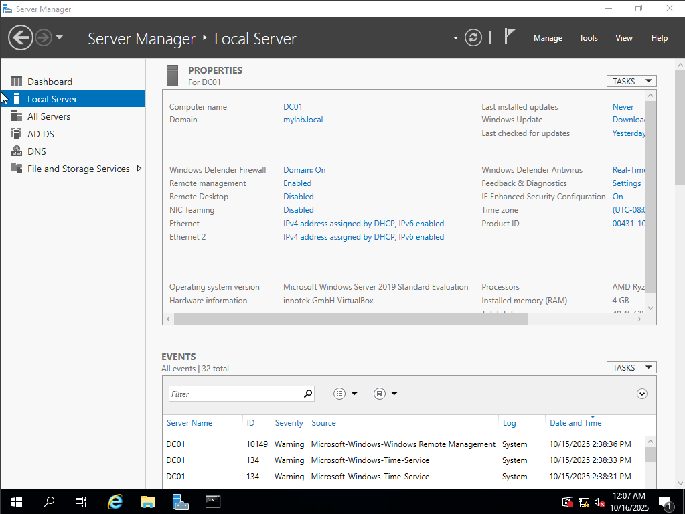

# 🧪 Active directory Lab

## 📚 Table of Contents
- [Overview](#1️⃣-overview)
- [Objectives](#2️⃣-objectives)
- [Process](#3️⃣-process)
- [Challenges](#4️⃣-challenges)
- [Takeaways](#5️⃣-takeaways)

## 1️⃣ Overview 
> This is a self guided lab that focuses on setting up a Windows domain controller using Active Directory to understand authentication, DNS, and client management. Utilizing virtual machines (VMs) to deploy both the Windows server 2019 and the Windows workstation I plan to see what I can do with both the client and domain controller.

## 2️⃣ Objectives
- Learn how to install and promote a Windows Server to a domain controller.  
- Practice joining clients to a domain.  
- Understand how DNS supports Active Directory.

## 3️⃣ Process
1. Installed Windows Server 2019 and Ubuntu on VirtualBox.  
2. Set a static IP and installed Active Directory Domain Services.
3. Set up a Domain Controller to the Windows Server 2019. Image: Domain controller established with domain name mylab.local. 
4. Created and joined a Windows 10 client to the domain. 
5. Created a new user account and set a password for user "John Doe". 
6. Checked Event Viewer security logs on Domain Controller to see if our new user account John Doe was logged.
7. Saved baseline snapshots within VirtualBox for each of the three machines. The WIndows Server, client, and Ubuntu machine. This is just in case I break something later down the line with projects that will need restoring. 

## 4️⃣ Challenges
- **Issue:** Client couldn’t reach the domain I created called "mylab.local" 
This problem occured as a result of the Windows 10 Client trying to find mylab.local using my home internet DNS instead of asking the Domain Controller which is the one that knows about mylab.local.

 - **Solution:**  Changed DNS on the client to point to the Domain Controller.

- **Issue:** When looking for Event Viewer Security logs for account "John Doe" no logs were found. Found that when logged into John Doe account and pinging mylab.local Domain Controller that it was not found.
- **Solution:** I had to clear the computer's cached DNS list by flushing the DNS. Then I re-registered the DNS by forcing the workstation to announce itself to the Domain Controller. Now it pings like it should.

## 5️⃣ Takeaways
- DNS is critical to Active Directory functionality.  
- Planning IPs ahead prevents future issues.  
- This is the beginning of a long journey ahead. Whenever something breaks it will be on me and me alone to fix.
- IT systems are complex and will come with a plethora of issues that need resolving.
