# 🧪 Wazuh SIEM + Endpoint detection Lab

## 📚 Table of Contents

- [Overview](#overview)
- [Objectives](#objectives)
- [Process](#process)
- [Challenges](#challenges)
- [Takeaways](#takeaways)

## Overview
  
> This is a self guided lab with the goal of setting up my very first SIEM (Security Information Event Manager) using Wazuh with endpoint detection integration. 01-ActiveDirectory-Lab set up the virtual machines and I plan on installing the Wazuh server on the Ubuntu virtual machine.

## Objectives

- Learn to install Wazuh using command line scripts.  
- Begin to understand how endpoint events are collected and visualized in an enterprise environment.

## Process

1. Open all three VM's (Domain Controller, Workstation, Ubuntu client) and ping each other to make sure there is connectivity between the Ubuntu client and both windows 10 machines.

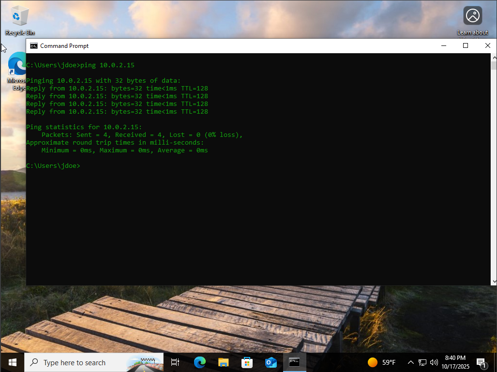
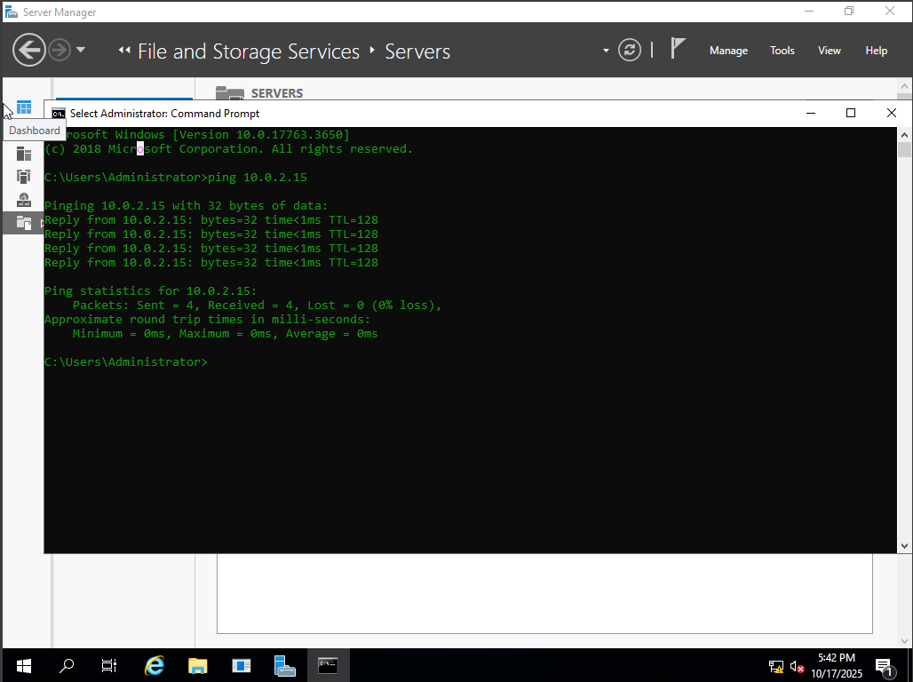

2. Use command line to obtain Wazuh application through "apt get" commands on Ubuntu. The temporary wazuh username and password was given on application install.
3. Use Windows 10 client browser to sign into wazuh dashboard utilizing Ubuntu IP address.

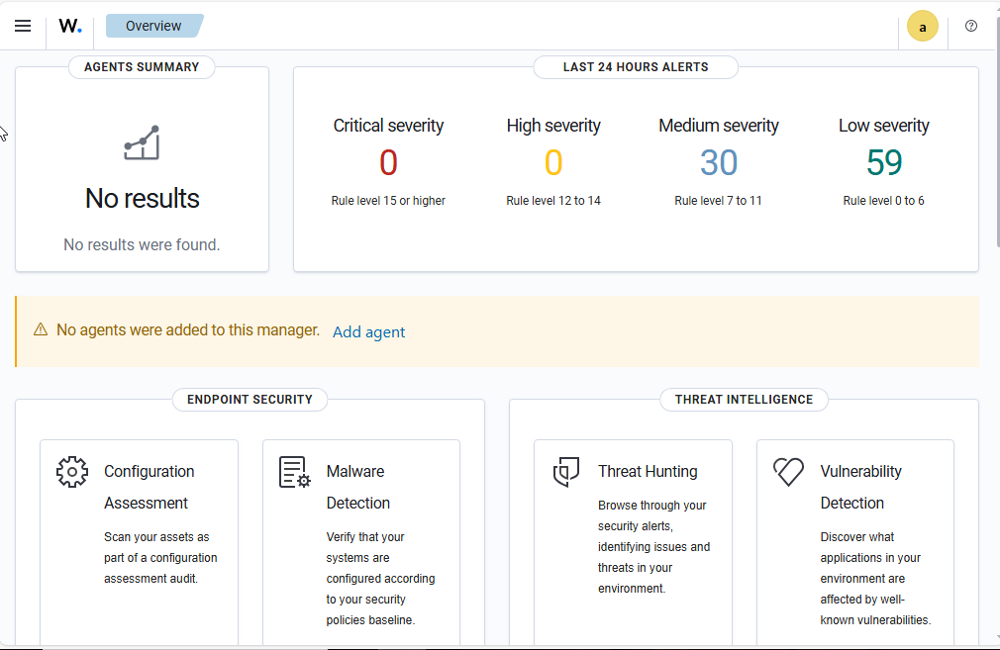

4. Installed an "agent" on the Windows 10 client from Wazuh.

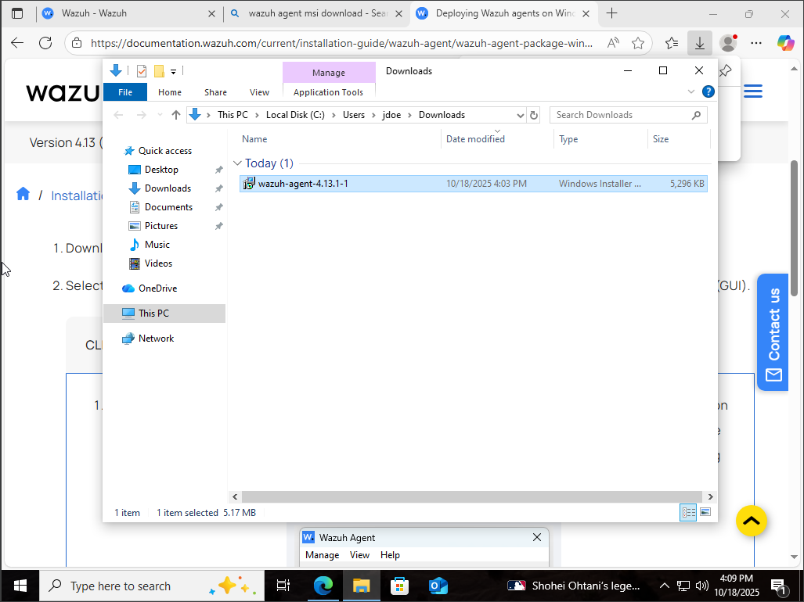

5. Register the agent. This connects the agent from my Windows Client to Ubuntu.

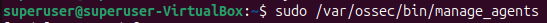
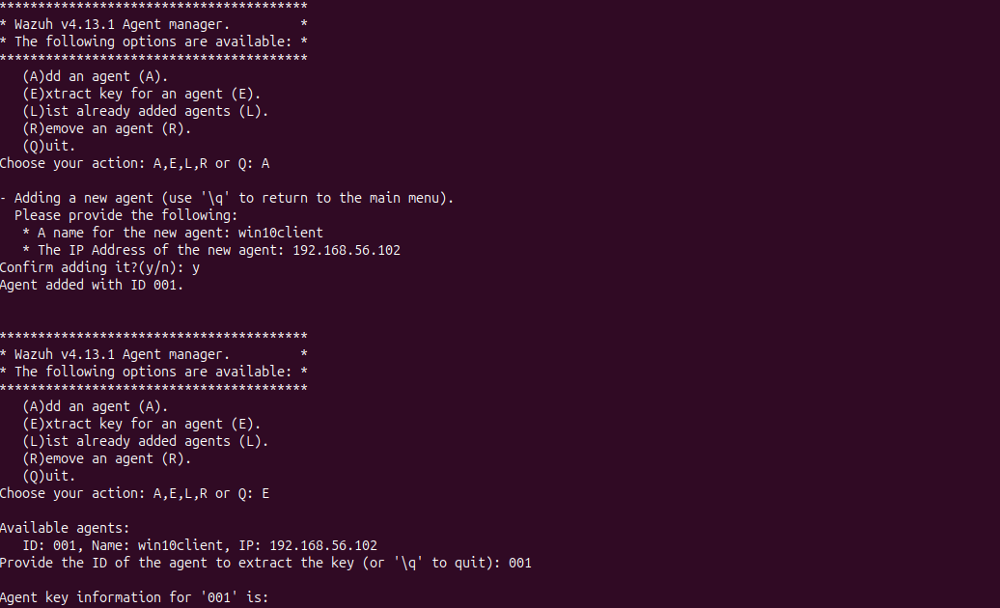 Then we reload the manager for effects to take place.

6. Agent registration is complete and after configuring agent using GUI on windows 10 it shows up in the dashboard.

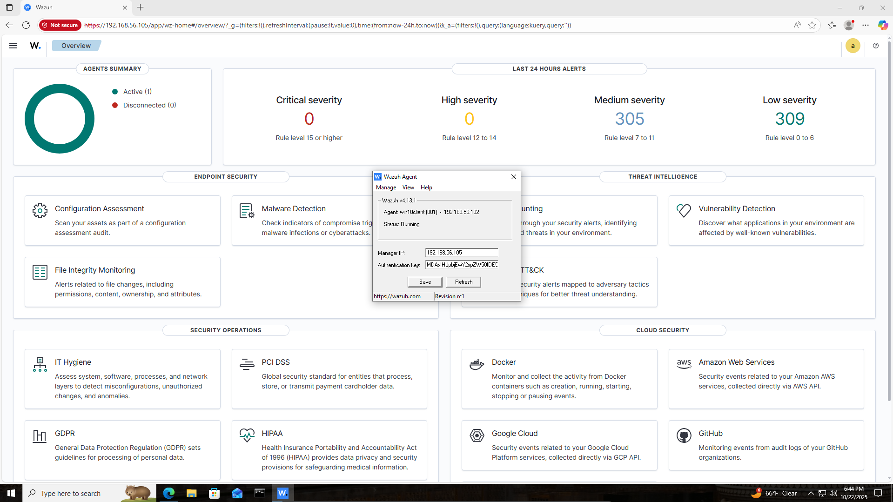

## Challenges

**Issue:** After installing Wazuh on the Ubuntu VM trying to connect the Windows 10 client John Doe to Wazuh it gave a "refused to connect" error.

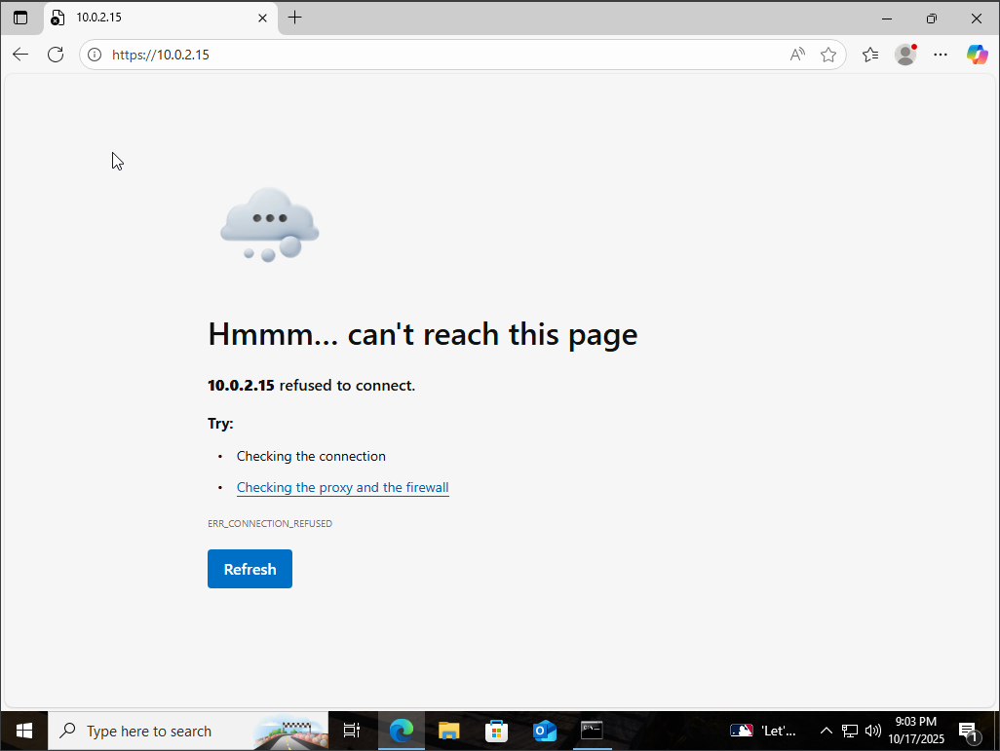

**Solution:** This error occurred as a result of the Ubuntu VM not having correct network settings in VirtualBox, however switching from "NAT" to "Host-only adapter" fixed the issue.

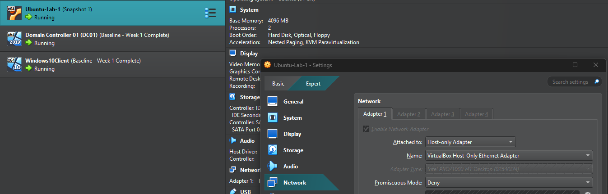
  
**Issue:** Ran into an invalid request when trying to connect Wazuh agent on windows 10 to Wazuh manager.

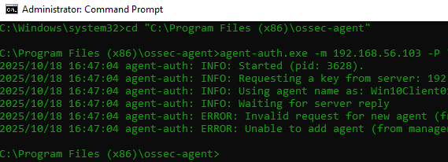

**Solution:** It seems the agent wasn't created and I needed to create on the Ubuntu VM. From there I extracted the key after creating the agent with name "win10client" by adding it's IP address using the Windows 10 "John Doe" client.

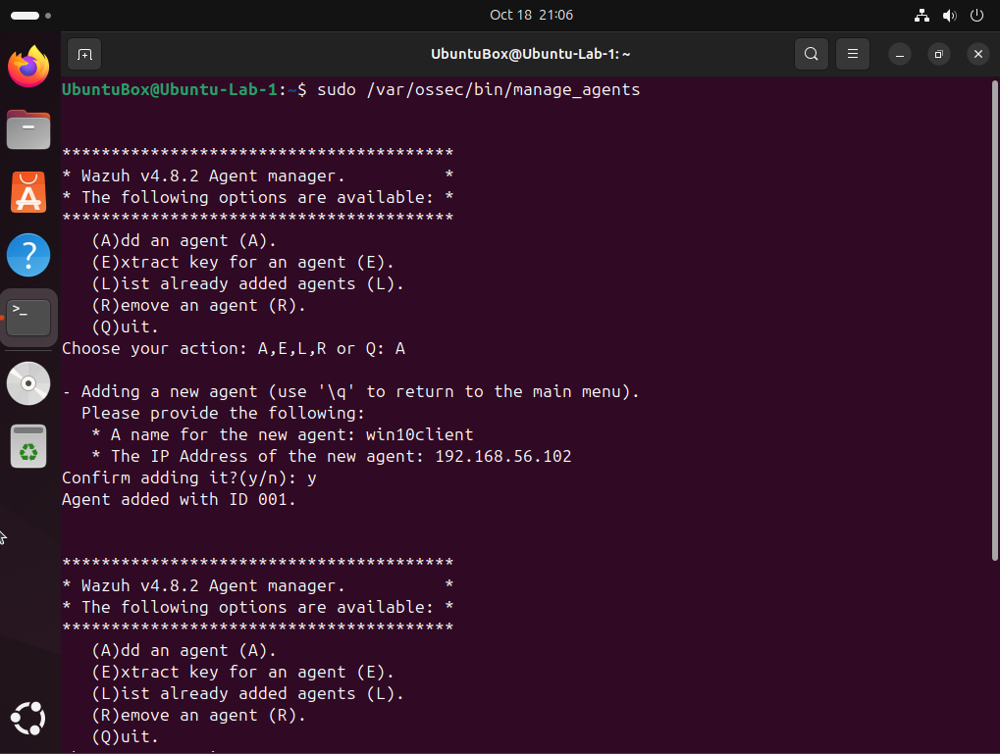
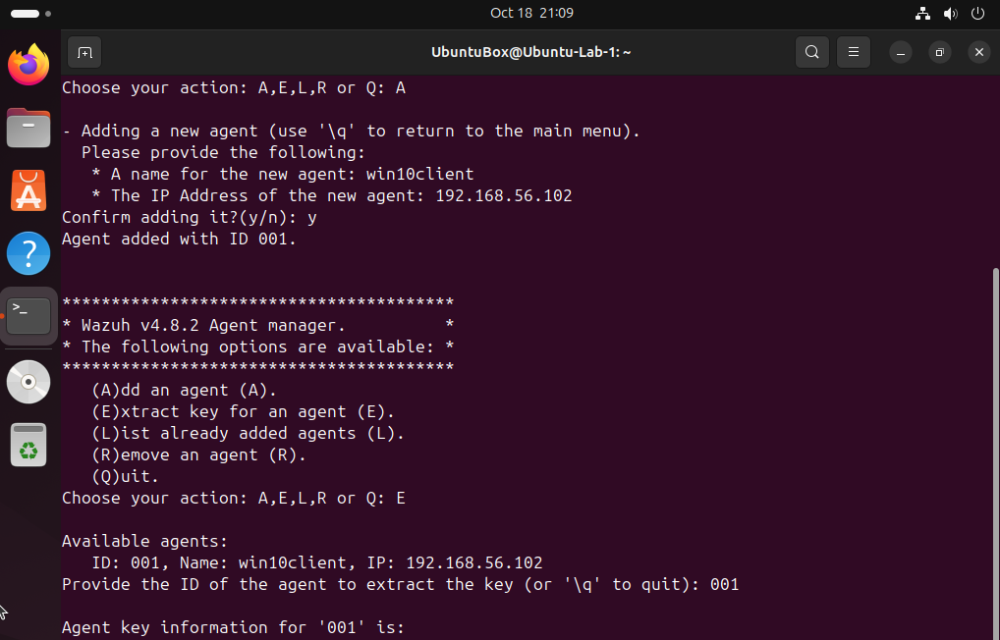

**Issue:** Wazuh version # mismatch between wazuh agent (windows 10 client running 4.13.1) and wazuh manager (Ubuntu runninng 4.8.x)

**Solution:** Synced versions between wazuh agent and wazuh manager to be able to see client on dashboard.

**Issue:** After updating wazuh manager I ran into an issue with the Wazuh dashboard not starting on the windows 10 client. There is a missing module that is causing the dashboard to fail.

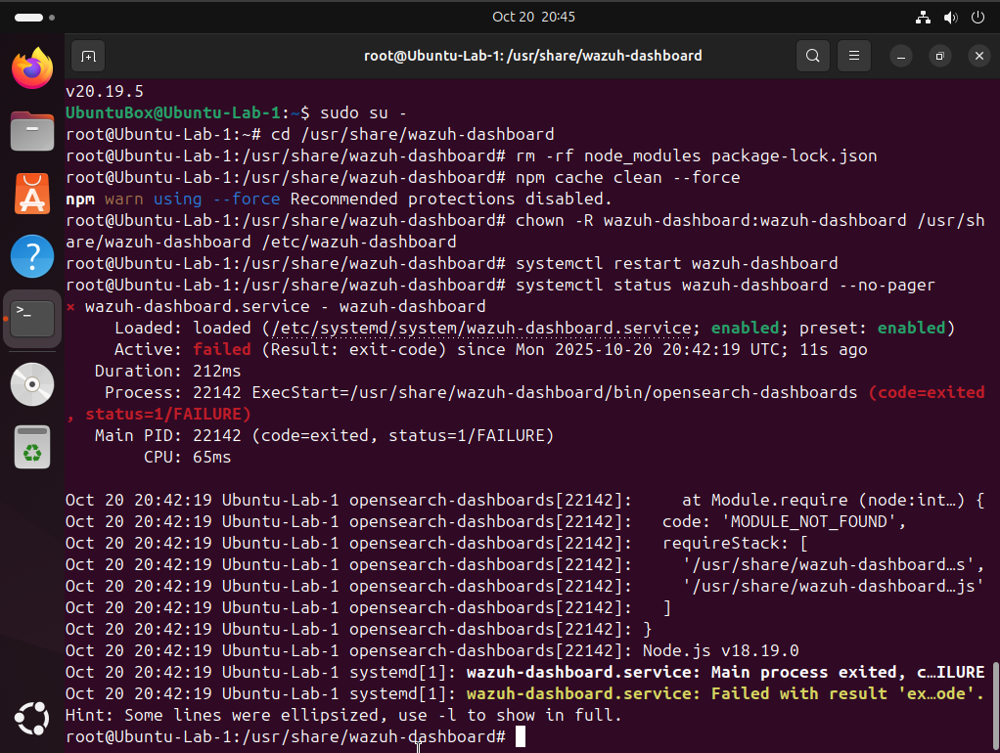

**Solution:** The folder /usr/share/wazuh-dashboard/node/bin that was housing node was expected to be there when I upgraded versions of Wazuh but it was missing/incorrect. So I recreated it and made it point to the systems Node 20 version of node and made sure that Wazuh dashboard was the owner of said folder.

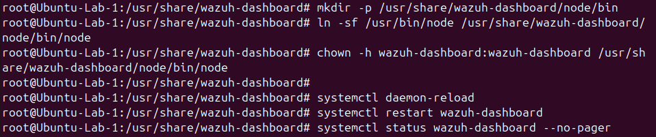
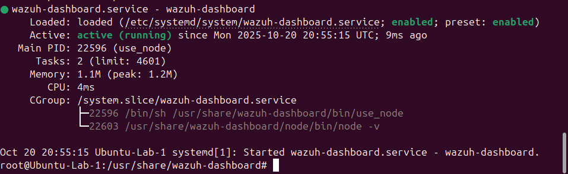

**Issue:** After getting the dashboard back active again. I ran into the dashboard not starting when trying to open it on the browser again.

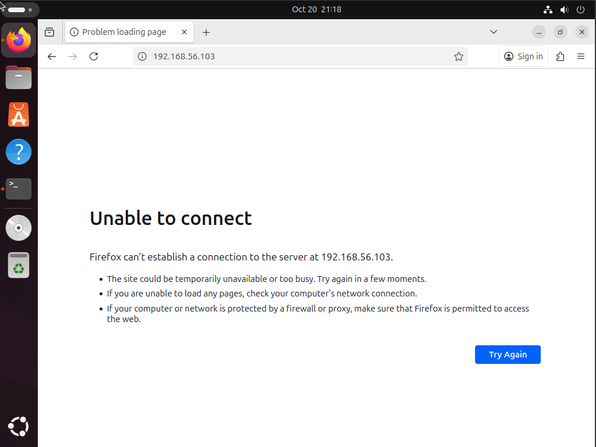

**Solution:** 😒 Hours later I figure out it was because I did not use port 443 when trying to open the dashboard... So instead of 192.168.56.xxx I forgot the https://192.168.56.xxx

## Takeaways

- Versions between agent and manager must match in Wazuh for proper communication.
- DNS is critical to AD functionality.  
- Planning IPs ahead prevents future issues.  
- An agent is a piece of software that when installed on a computer collects security data and sends it back to a central system for analysis. They are useful for SOC's as they act as a security sensor.
- MSI just stands for Microsoft Software Installer.
- Node.js (or just *Node*) is a program that runs JavaScript outside of a web browser and Wazuh needs this program to start it's dashboard.
- Wazuh dashboard uses port 443. Wazuh agent communication through manager uses port 1514. Agent enrollment uses port 1515.
- Proper network configuration (Host-only) ensures inter-VM connectivity.
- Reinforced the importance of documenting every error, solution, and configuration step clearly.
