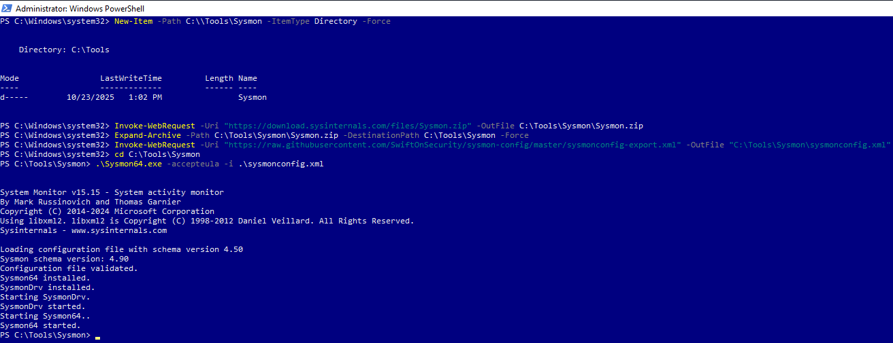
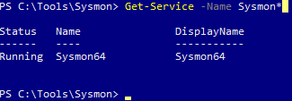
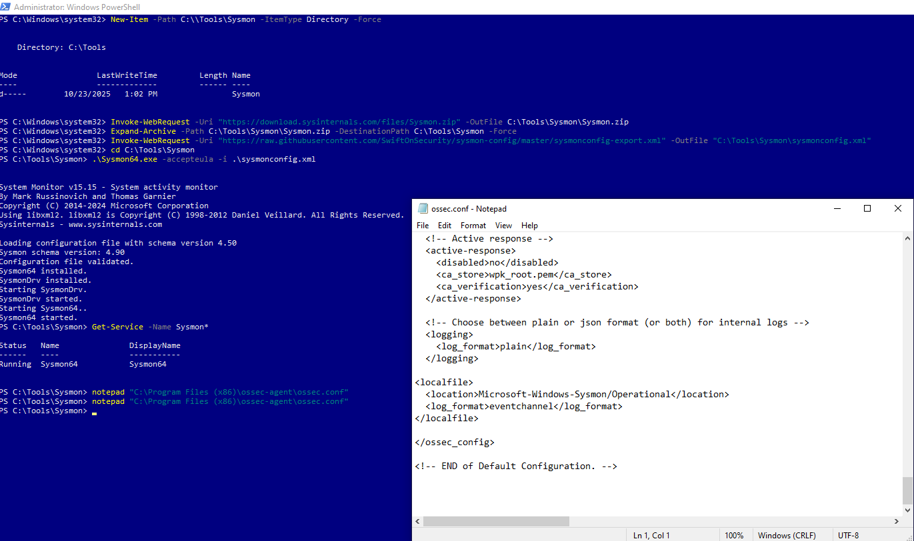
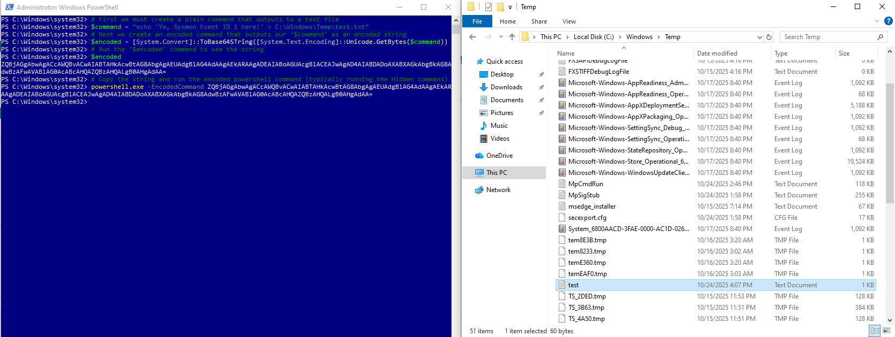
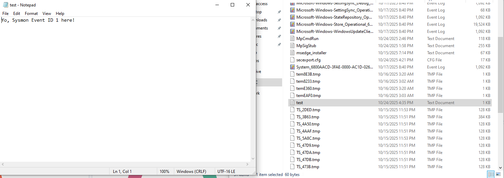
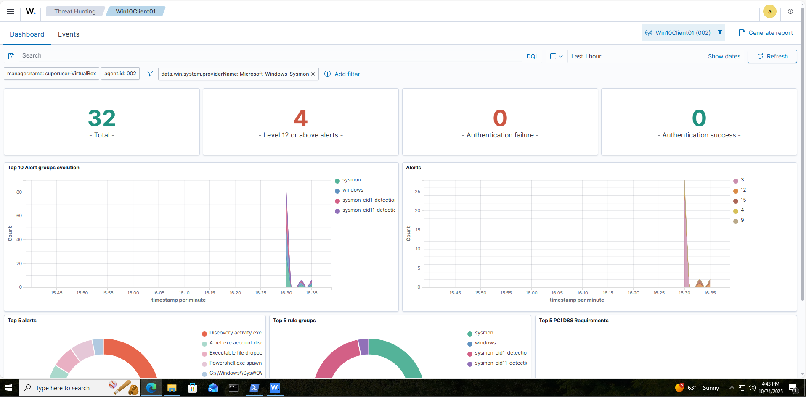

# 🧪 Sysmon Threat Simulation & Detection

## 📚 Table of Contents

- [Overview](#overview)
- [Objectives](#objectives)
- [Process](#process)
- [Challenges](#challenges)
- [Takeaways](#takeaways)

## Overview

Install sysmon to connect to our SIEM agent and use that to monitor alerts ON Windows 10 client through Wazuh. After the sysmon-Wazuh pipeline is created a simulation will take place to display that sysmon is generating events and sending them properly to Wazuh.

## Objectives

- Download Sysmon (System monitoring) through windows powershell
- Connect Sysmon to Wazuh agent
- Simulate threat to have Sysmon generate an event that the Wazuh agent will pick up on and display to the Dashboard.

## Process

1. Utilize administrator powershell to create a folder for and download sysmon for windows 10 client. Commands to use to download documented through image.

2. Opened Event Viewer to confirm that Sysmon is actually writing event logs to the Windows 10 client.

3. The next step we need to take is to connect sysmon to the Wazuh agent on this system to have Wazuh read the logs that sysmon puts out through event viewer. We do this by editing the configuration file of Wazuh with the below XML code. The output of the XML code will not be readable until the Wazuh agent restarts and begins to read the output of Sysmon logs.

4. To Ultimately confirm whether the Wazuh-Sysmon pipeline is working I have to go check the Wazuh Dashboard to confirm. Threats will appear in the threat hunting section of Wazuh. I am filtering for a windows system name and using the dropdown for Sysmon.

5. I wanted to simulate a suspicious event that creates a process on sysmon. The "suspicious' process I chose was to create a .txt file that was obfuscated by Base64Encoding to just look like a string, but it executes a command. Steps to reproduce the code are included as comments in the image "Obfuscated Base64Encode process" below.

6. Check that the attacker code successfully ran and created a process that triggered event id 1 by Sysmon. To check this I went to the Wazuh-Dashboard under the threat hunting section and filtering by Windows system name sysmon. This benign threat triggered a warning. I also filtered for Event 1 in the Events tab of the threat hunting section and it showed up there as well.

7. The Sysmon - Wazuh pipeline already detects that a powershell process was executed and there is no need to create a rule to detect that on this system.

## Challenges

**Issue:**
Tried to restart the Wazuh agent, but got an error indicating the name was incorrect.

**Solution:**
Had to find code to search for the name of the Wazuh agent and restart the service.

**Issue:**
I wanted to simulate a suspicious event that creates a process on sysmon that shows event ID 1, process creation, to show up on the threat hunting section of the Wazuh dashboard. The problem is I did not know any code to create a process that looks malicious that is obfuscated.

**Solution:**
Reproduce code from well known sources that is safe to use on my Virtual Machine that I did not necessarily know beforehand.

## Takeaways

- There are at 29 distinct Sysmon Event ID's
- GUI's are simple tools to use for a user for visibility and simplicity, where as the CLI is a powerful tool that allows for an extensive range of flexibility of creating, downloading, running scripts, etc.
- Bad actors can successfully hide code in encoded command strings that are not human readable to an untrained eye.
- The \$ command creates a variable. Example: \$variable
- Powershell variables use = to save commands to that variable. Example: $command = "echo 'Hello World!' > C:\Windows\Temp\test.txt" saves the string Hello World to the text file test.txt.
- -EncodedCommand uses base64 encoded strings that also run whatever that string says.

***
