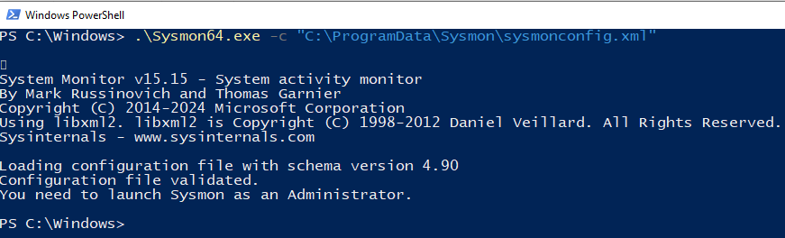
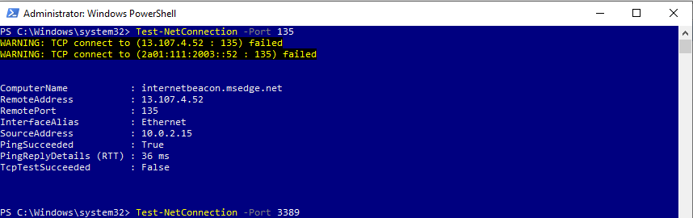
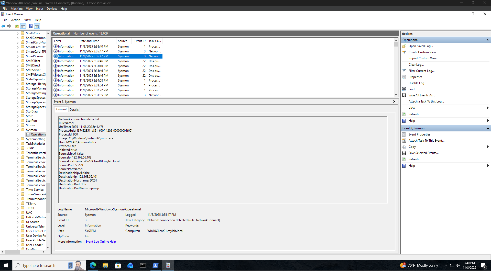
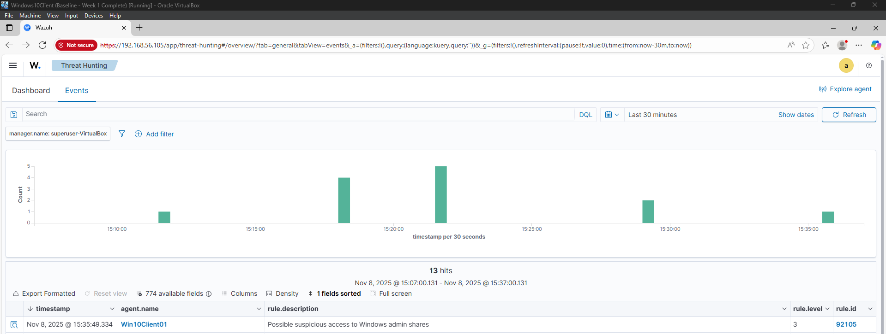
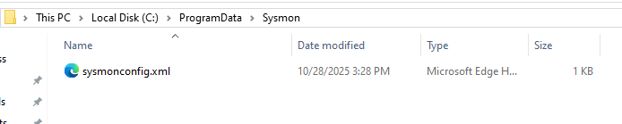
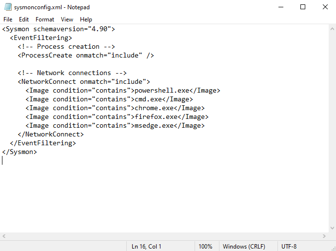
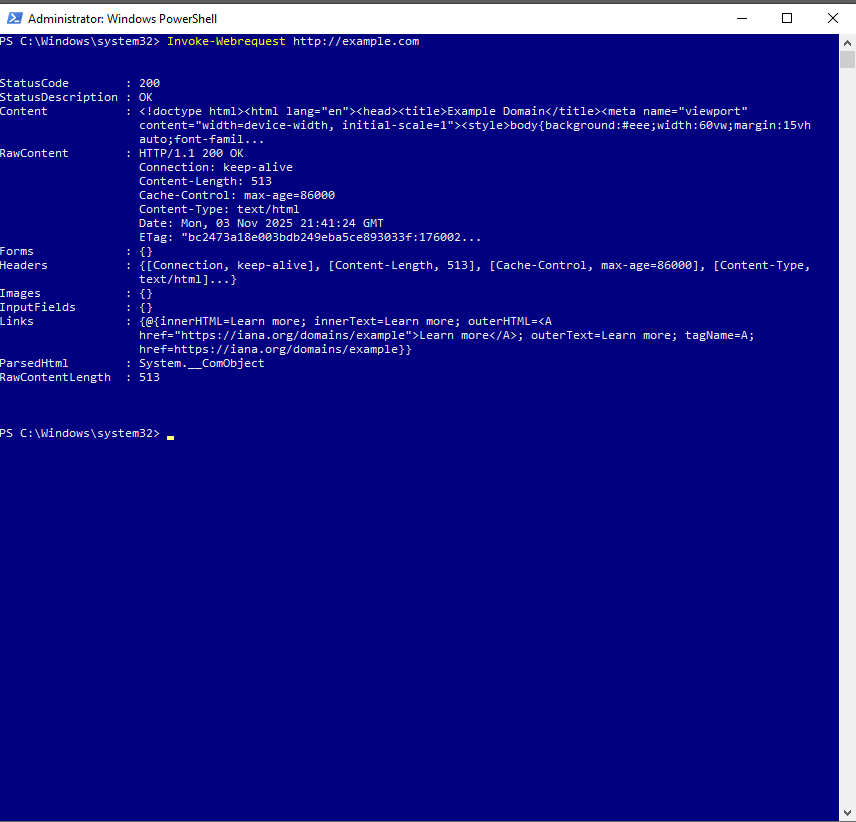
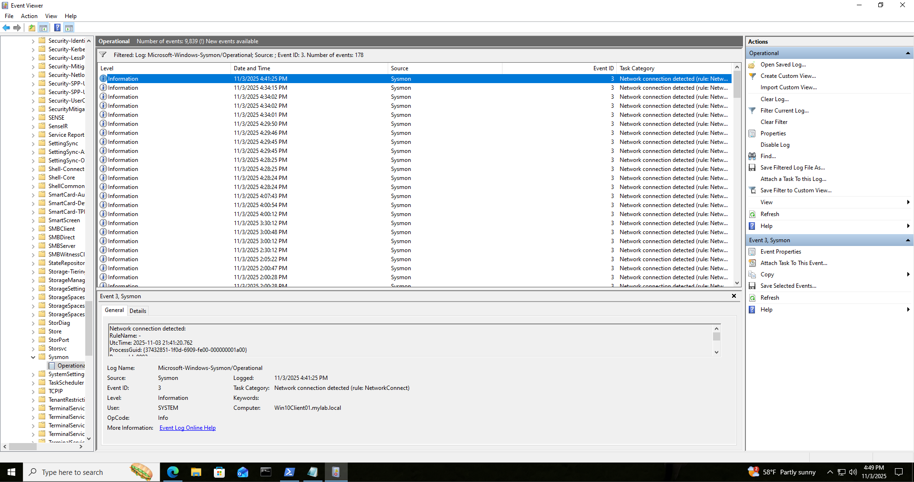
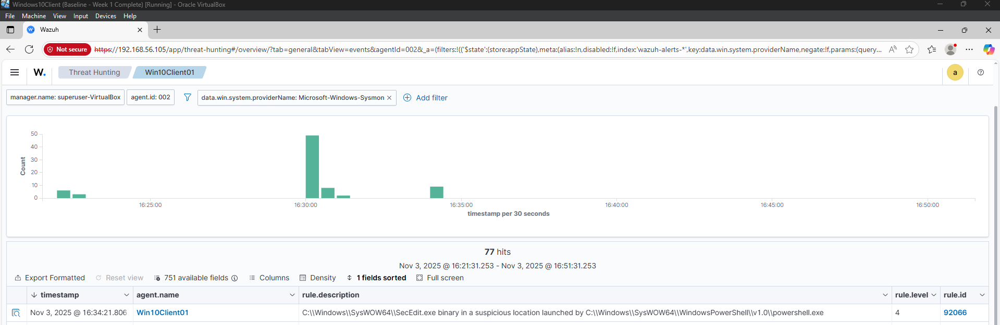

# 🧪 Sysmon Network Visibility lab

## 📚 Table of Contents

- [Overview](#overview)
- [Objectives](#objectives)
- [Process](#process)
- [Challenges](#challenges)
- [Takeaways](#takeaways)

## Overview

The focus of this lab is to expand endpoint visibility by enabling Sysmon's event ID 3 for network connections. Then to correlate it with Sysmon event ID 1 which is process creation in Wazuh.

## Objectives

- Modify the sysmon configuration to log event id 3 for outbound network connections.
- Generate safe test activity to simulate normal outbound traffic.
- Confirm that the resulting network connection events are are seen on Wazuh and are correlated with process creation (Event ID 1)
- Understand which processes initiate network activity.

## Process

1. Create XML configuration file for Sysmon
2. The Sysmon.exe configurations need to point towards the path where the configuration file is. (It is best practice to not store the configuration file in the same directory as the executable)

3. Generate a test network event so that Sysmon can log Event ID 3.

## Challenges

**Issue:**

I didn't install Sysmon with configuration files.

**Solution:**
Created the configuration file named Sysmonconfig.xml.

**Issue:**

Sysmon configuration files were blank on creation.

**Solution:**

I had to add the markup configurations myself for events related to browser and terminal activity.

**Issue:**

When invoking a web request to *http://example.com*  the web request connection is successful. Checking the Event Viewer event ID 3 (Network connections) from that web request the information for the event is provided. The issue arises when looking for the event on Wazuh through threat hunting. The event does not show at all.

**Solution:**

Mistakenly I assumed that any traffic outbound on the network would be logged by both sysmon and Wazuh. This is not the case as normal web traffic through both port 80 and port 443 will not be logged by Wazuh. Otherwise thousands of so-called alerts would flood the SIEM a day. Only abnormal ports invoking event ID 3  in Wazuh's rule book will be flagged unless a rule is created for said traffic. (TLDR I WAS POKING OSI LAYER 7, APPLICATION, RATHER THAN LAYER 3, NETWORK.)

## Takeaways

- Only abnormal traffic will be monitored logged by Wazuh according to it's rules. Ports 80 and 443 most likely will not trigger a rule.
- Sysmon always logs events no matter how small.

***
